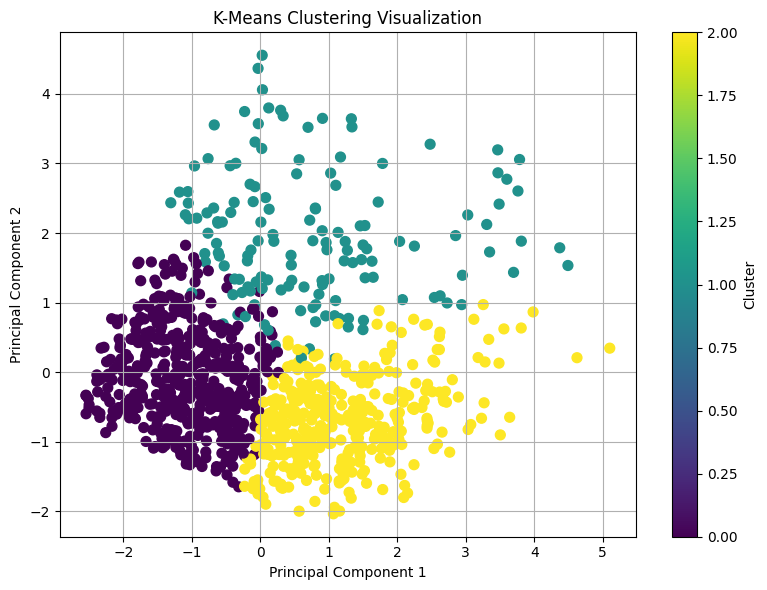

# K-Means Clustering Project

This project demonstrates the implementation of the K-Means clustering algorithm in Python. It is divided into two main parts:

1. **Manual Implementation**: The K-Means algorithm is implemented from scratch using only NumPy and Pandas.
2. **Sklearn & Visualization**: The K-Means algorithm is applied using the `scikit-learn` library, and the resulting clusters are visualized in 2D space using Principal Component Analysis (PCA) and `matplotlib`.

## Project Structure

```
.
├── kmeans_clustering.ipynb     # Jupyter Notebook containing both parts of the project
├── Dataset.xlsx                 # Dataset used for clustering (replace with actual filename)
├── cluster_plot.png            # Screenshot of the cluster visualization
├── README.md                   # Project documentation
```

## Getting Started

### Prerequisites
To run this project, you need Python 3.x and the following Python libraries :

- numpy
- pandas
- matplotlib
- scikit-learn

You can install the required libraries using pip:

```bash
pip install numpy pandas matplotlib scikit-learn
```

### Running the Notebook
1. Open `kmeans_clustering.ipynb` in Jupyter Notebook or JupyterLab.
2. Run the cells sequentially.
3. The notebook is structured with clear markdown headers for both manual and sklearn-based implementations.

## Dataset
Ensure the dataset file (e.g., `dataset.csv`) is present in the same directory as the notebook. The dataset should be numeric and suitable for clustering. (You can modify the notebook if using a different dataset.)

## Features
- **Part 1**: Pure NumPy and Pandas-based K-Means implementation
  - Random centroid initialization
  - Iterative reassignment and centroid update
  - Convergence detection
- **Part 2**: scikit-learn KMeans application
  - Easy configuration of number of clusters
  - Dimensionality reduction with PCA
  - 2D visualization of clusters

## Output

### Cluster Visualization (PCA)


The output includes:
- Cluster assignments for each data point
- Final centroid positions
- 2D scatter plot with color-coded clusters

## License
This project is licensed under the MIT License. You are free to use, modify, and distribute it.

## Acknowledgements
- Inspired by introductory machine learning tutorials.
- Built as a learning exercise to understand K-Means clustering in depth.

---

Feel free to fork the repository, explore, and enhance the clustering capabilities!
